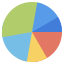

# react-charty [](https://www.npmjs.com/package/react-charty)

This component was born during the Teleram contest where I took one of the prize places.
Big ups to the Telegram team.

### Features

- Small footprint (it's just 11KB minified and gzipped)
- The following charts are supported: line, multi_yaxis line, stacked bars, percentage, pie
- Supports thousands of records (thanks to the fast Segment Tree algorithm)
- A wide variety of supported browsers on different platforms (including mobiles)
- Theme support
- Fancy animations
- Zoom-in support
- No dependencies, the core is Vanilla JS
- Can be used as a standalone library without React

### Browsers support

| </br>IE 11 / Edge | </br>Firefox | </br>Chrome |</br>Safari | </br>iOS Safari | </br>Samsung | </br>Opera |
| --------- | --------- | --------- | --------- | --------- | --------- | --------- |

### Installation

```bash
npm install --save react-charty
```
or
```bash
yarn add react-charty
```

### Basic Usage

```jsx static
import React, { Component } from 'react'
import Charty from 'react-charty'

export default class App extends Component {
  render () {
    return (
      <Charty title="Followers" data={data[0]} />
    )
  }
}
```

### Theming

```jsx static
import React, { Component } from 'react'
import Charty from 'react-charty'

const LIGHT_THEME = {
        grid: { color: '#182D3B', alpha: 0.1, markerFillColor: '#fff' },
        legend: { background: '#fff', color: '#000' },
        preview: { maskColor: '#E2EEF9', maskAlpha: 0.6, brushColor: '#C0D1E1' },
        xAxis: { textColor: '#8E8E93', textAlpha: 1 },
        yAxis: { textColor: '#8E8E93', textAlpha: 1 },
        title: { color: '#000' },
        localRange: { color: '#000' },
        zoomedRange: { color: '#000' }
      },
      DARK_THEME = {
        grid: { color: '#fff', alpha: 0.1, markerFillColor: '#242f3e' },
        legend: { background: '#1c2533', color: '#fff' },
        preview: { maskColor: '#304259', maskAlpha: 0.6, brushColor: '#56626D' },
        xAxis: { textColor: '#A3B1C2', textAlpha: 0.6 },
        yAxis: { textColor: '#A3B1C2', textAlpha: 0.6 },
        title: { color: '#fff' },
        localRange: { color: '#fff' },
        zoomedRange: { color: '#fff' }
      },
      IS_MOBILE = window.orientation !== undefined;

export default class App extends Component {
  constructor(props) {
    super(props);

    this.state = {
      isLoaded: false,
      theme: LIGHT_THEME,
      data: []
    }
  }

  async componentDidMount() {
    const dataFiles = [1,2,3,4,5].map((id) => fetch(`data/${id}/overview.json`)),
          results = await Promise.all(dataFiles),
          data = await Promise.all(results.map((r) => r.json()));

    this.setState({
      isLoaded: true,
      data
    })
  }

  switchTheme = () => {
    const isDarkTheme = this.state.theme === DARK_THEME;

    this.setState({
      theme: isDarkTheme ? LIGHT_THEME : DARK_THEME
    })
    document.documentElement.className = !isDarkTheme && 'dark';
  }

  render () {
    if (!this.state.isLoaded)
      return null;

    const width = IS_MOBILE ? '100%' : '50%',
          theme = this.state.theme,
          data = this.state.data;

    return (
      <React.Fragment>
        <h3 onClick={this.switchTheme}>Switch theme</h3>
        <div style={{display: 'flex', flexDirection: 'row', flexWrap: 'wrap'}}>
          <Charty title="Followers" theme={theme} style={{ width }} data={data[0]} />
          <Charty title="Interactions" theme={theme} style={{ width }} data={data[1]} />
          <Charty title="Messages" theme={theme} style={{ width }} data={data[2]} />
          <Charty title="Views" theme={theme} style={{ width }} data={data[3]} />
          <Charty title="Fruits" theme={theme} style={{ width, paddingBottom: 50 }} data={data[4]} />
        </div>
        <h3 onClick={this.switchTheme}>Switch theme</h3>
      </React.Fragment>
    )
  }
}
```

### Component props

| Name            | Type        |                                                                     |
|-----------------|-------------|---------------------------------------------------------------------|
|`type`           |String       |The chart type, can be one of the following values: `line`, `bar`, `percentage_area`, `stacked_bar`, `multi_yaxis`, `pie`. The default value is `line`.|
|`data`           |Object       |Contains the data points for chart series. Every key of this object is an array of data points. The `x` array is mandatory and contains the data for x-axis while other keys represent the data points for y-axis. There could be multiple series in one chart and thus several data arrays for y-axis, for example `y`, `y0`, `y1`, `yAxis` etc. The key name can be any and is used as reference for name, color etc. The key name also defines the rendering order (alphabetically).|
|`names`          |Object       |Contains the names for data series, referenced by key. For example, `names: { y0: 'Views', y1: 'Clicks' }`|
|`colors`         |Object       |Contains the colors for data series, referenced by key. For example, `colors: { y0: '#4BD964', y1: '#FE3C30' }`|
|`animated`       |Boolean      |Enables/disables animations and transitions, default value is `true`.|
|`startX`         |Number       |The starting value for .|
|`endX`           |Number       |The starting value for .|
|`onZoomIn`       |Function     |This callback is called when some point is clicked on chart. |
|`stepX`          |Number       |The value to increase / decrease current X axis position when dragging or moving the chart preview region. For example, i
f you have X axis of type `timestamp` and you want to navigate by one day, you can set the `stepX` value to `86400000`. The default value is `1`.|
|`showLegend`     |Boolean      |If set to `false` the legend will not appear when moving cursor over the chart (or tapping chart area on mobile). The default value is `true`.|
|`legendPosition` |Boolean      |Defines the position of legend popup and can be one of the following values: `top`, `bottom`, `cursor`. The default value is `cursor`, which means the popup will follow the mouse cursor position.|
|`showPreview`    |Boolean      |If set to `false` the chart preview won't be visible. The default value is `true`.|
|`showButtons`    |Boolean      |If set to `false` the series buttons won't be visible. The default value is `true`.|
