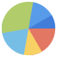
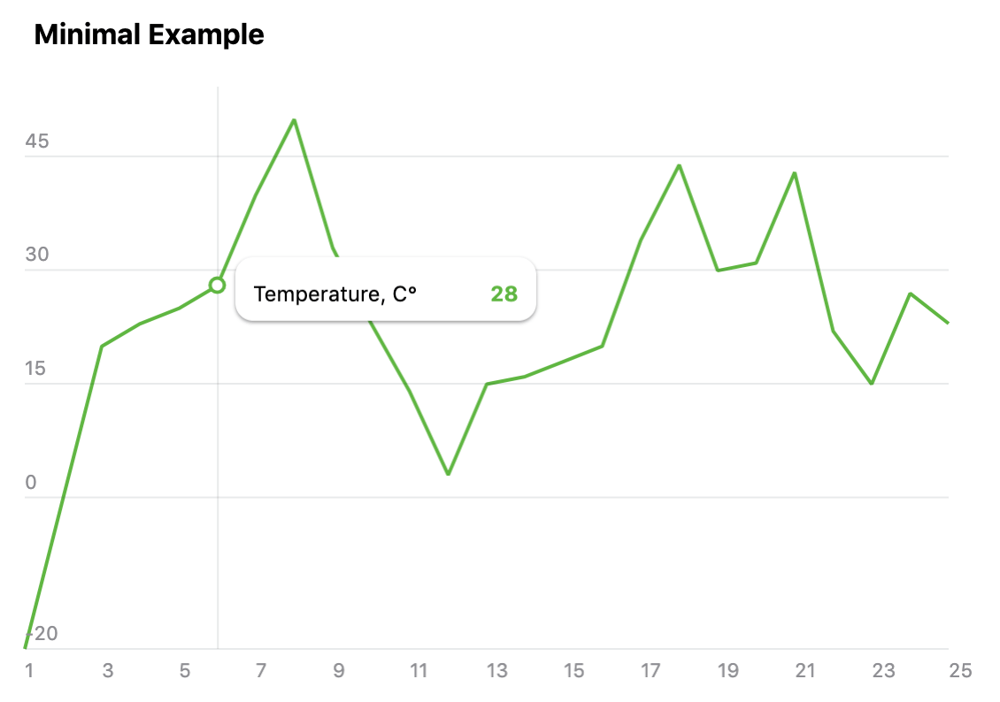

# react-charty [](https://www.npmjs.com/package/react-charty)

This component was born from the [Teleram](https://telegram.org/) programming contest where I took one of the prize places.
Below you will find the instructions how to use and customize this component. I hope you will find it useful to visualize your precious data.
Big ups to the Telegram team and all contestants.

Please check the [Demo App](https://99ff00.github.io/react-charty/).

### Features

- Small footprint (it's just 14KB minified and gzipped)
- The following charts are supported: line, multi_yaxis line, stacked bars, percentage, pie
- Supports thousands of records (thanks to the fast Segment Tree algorithm)
- A wide variety of supported browsers on different platforms (including mobiles)
- Theme support
- Fancy animations
- Zoom-in support
- No dependencies, the core is Vanilla JS
- Can be used as a standalone library without React

### Browsers support

| </br>IE 11 / Edge | </br>Firefox | </br>Chrome |</br>Safari | </br>iOS Safari | </br>Samsung | </br>Opera |
| --------- | --------- | --------- | --------- | --------- | --------- | --------- |

### Installation

```bash
npm install --save react-charty
```
or
```bash
yarn add react-charty
```

### Usage

Here's an example how to get a really basic chart like the one on this screenshot below. For more complex examples please check the [Demo App](https://99ff00.github.io/react-charty/).



```jsx static
import React, { Component } from 'react'
import Charty from 'react-charty'

const MINIMAL_EXAMPLE_DATA = {
    type: 'line',
    data: {
      x: [1, 2, 3, 4, 5, 6, 7, 8, 9, 10, 11, 12, 13, 14, 15, 16, 17, 18, 19, 20, 21, 22, 23, 24, 25],
      y0: [-20, 0, 20, 23, 25, 28, 40, 50, 33, 23, 14, 3, 15, 16, 18, 20, 34, 44, 30, 31, 43, 22, 15, 27, 23]
    },
    colors: {
      y0: '#5FB641'
    },
    names: {
      y0: 'Temperature, C°'
    },
    startX: 1,
    endX: 25,
    xAxisStep: 2,
    showPreview: false,
    showRangeText: false,
    showLegendTitle: false
  };

export default class App extends Component {
  render () {
    return (
      <Charty title="Temperature" {...MINIMAL_EXAMPLE_DATA} />
    )
  }
}
```

### Theming

The chart controls can be customized via `theme` prop. Here's an example of two themes. The `LIGHT_THEME` is hardcoded in chart component and used if no theme is provided.
For theme switching example please check the [Demo App](https://99ff00.github.io/react-charty/). Also, please check [styles.css](./src/styles.css) for even more customization.

```jsx static
const LIGHT_THEME = {
  grid: { color: '#182D3B', alpha: 0.1, markerFillColor: '#fff' },
  legend: { background: '#fff', color: '#000' },
  preview: { maskColor: '#E2EEF9', maskAlpha: 0.6, brushColor: '#C0D1E1' },
  xAxis: { textColor: '#8E8E93', textAlpha: 1 },
  yAxis: { textColor: '#8E8E93', textAlpha: 1 },
  title: { color: '#000' },
  localRange: { color: '#000' },
  zoomedRange: { color: '#000' }
};

const DARK_THEME = {
  grid: { color: '#fff', alpha: 0.1, markerFillColor: '#242f3e' },
  legend: { background: '#1c2533', color: '#fff' },
  preview: { maskColor: '#304259', maskAlpha: 0.6, brushColor: '#56626D' },
  xAxis: { textColor: '#A3B1C2', textAlpha: 0.6 },
  yAxis: { textColor: '#A3B1C2', textAlpha: 0.6 },
  title: { color: '#fff' },
  localRange: { color: '#fff' },
  zoomedRange: { color: '#fff' }
};
```

### Component props

| Name              | Type        | Description                                                         |
|-------------------|-------------|---------------------------------------------------------------------|
|`type`             |String       |The chart type, can be one of the following values: `line`, `bar`, `percentage_area`, `stacked_bar`, `multi_yaxis`, `pie`. The default value is `line`. Feel free to check [Demo App](https://99ff00.github.io/react-charty/) to see them all in action.|
|`data`             |Object       |Contains the data points for chart series. Every key of this object is an array of data points. The `x` array is mandatory and contains the data for x-axis while other keys represent the data points for y-axis. There could be multiple series in one chart and thus several data arrays for y-axis, for example `y`, `y0`, `y1`, `yAxis` etc. The key name can be any and is used as reference for name, color etc. The key name also defines the rendering order (alphabetically).|
|`names`            |Object       |Contains the names for data series, referenced by key. For example, `names: { y0: 'Views', y1: 'Clicks' }`.|
|`colors`           |Object       |Contains the colors for data series, referenced by key. For example, `colors: { y0: '#4BD964', y1: '#FE3C30' }`.|
|`theme`            |Object       |Contains the color theme for chart components. If omitted, the default theme will be used.|
|`animated`         |Boolean      |Enables/disables animations and transitions, default value is `true`.|
|`startX`           |Number       |The starting position of preview region. If not specified, the starting position of preview region will be at 2/3 of `x` axis.|
|`endX`             |Number       |The ending position of preview region. If not specified, the ending position of preview region will be at the end of `x` axis.|
|`stepX`            |Number       |The value to increase / decrease current `x` axis position when dragging or moving the chart preview region. For example, if you have X axis of type `timestamp` and you want to navigate by one day, you can set the `stepX` value to `86400000`. The default value is `1`.|
|`showLegend`       |Boolean      |If set to `false` the legend will not appear when moving cursor over the chart (or tapping chart area on mobile). The default value is `true`.|
|`showLegendTitle`  |Boolean      |If set to `false` the legend title will not appear. The default value is `true`.|
|`legendPosition`   |Boolean      |Defines the position of legend popup and can be one of the following values: `top`, `bottom`, `cursor`. The default value is `cursor`, which means the legend popup will follow the cursor position.|
|`showPreview`      |Boolean      |If set to `false` the chart preview won't be visible. The default value is `true`.|
|`showButtons`      |Boolean      |If set to `false` the series buttons won't be visible. The default value is `true`.|
|`showRangeText`    |Boolean      |Show/hide current range text in top right corner. The default value is `true`.|
|`rangeTextType`    |String       |Defines the display type of current range. It could be one of the following [DDT](#display-data-types) or can be function that accepts the `x` value of range starting and ending positions.|
|`xAxisType`        |String       |Defines the type of `x` axis.|
|`yAxisType`        |String       |Defines the type of `y` axis.|
|`xAxisStep`        |Number       |Defines the step for `x` axis. If not specified, the step value will be calculated automatically.|
|`onZoomIn`         |Function     |This callback is called when some point is clicked on chart. It should accept the clicked `x` position and must return `Promise` loading the next chart data. Originally, this callback was used to zoom in, i.e. display more details chart for selected `x`. But you can also use it to load any supported chart.|
|`zoomInterval`     |Number       |By default, when zomming the chart will try to figure out the start and the end of `x` axis. But you can also set the interval to zoom in (for example, if `x` axis is a timestamp and you want to zoom in into one week, the interval would be `604800000`) and chart will put the current position in the middle of this interval.|
|`zoomStepX`        |Number       |Same as `stepX`, but for zooming chart.|
|`autoScale`        |Boolean      |Automatically finds the min/max `y` values and scales the chart accordingly. If this prop is set to `false`, the min/max values can be set with `minY` and `maxY` props. The default value is `true`.|
|`minY`             |Number       |Set the minimum value for `y` axis. This property is ignored if `autoScale` is set to `true`.|
|`maxY`             |Number       |Set the maximum value for `y` axis. This property is ignored if `autoScale` is set to `true`.|

### Display Data Types

Currently the following data types are supported. If no data type is specified the chart assumes it's just an integer value.

| Type              | Description                                                                       |
|-------------------|-----------------------------------------------------------------------------------|
|`float1`           |Float value with 1 decimal place|
|`float2`           |Float value with 2 decimal places|
|`number`           |Integer value with housands separator, e.g. `9 189 141`|
|`time`             |Display time in format `HH:mm`, e.g. `09:42`|
|`date`             |Display date in format `MMM D`, e.g. `Jan 1`|
|`shortDate`        |Same like `date`|
|`longDate`         |Display date in format `D MMM YYYY`, e.g. `8 Jun 2003`|
|`longDateWeekDay`  |Same like `longDate`, but prepended with week day `ddd, D MMM YYYY`, e.g. `Sun, 8 sep 2019`.|
